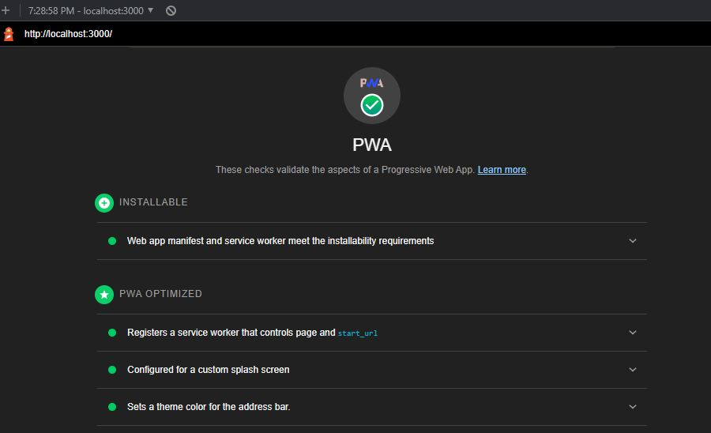

# PWA Text Editor

## Table of contents

- [General info](#general-info)
- [Technologies](#technologies)
- [App](#app)
- [Contact me](#contact-me)

## General info

This is a a text editor that runs in the browser. It uses methods for getting and storing data to an IndexedDB database.

## Technologies

Project is created with:

- JavaScript
- Express
- IndexedDB
- Webpack

## App

- [Deployed Link](https://text-editor1122.herokuapp.com/)

- Lighthouse Screenshot

  

## Contributions

- MDN, dev.to, https://www.npmjs.com/package/idb#opendb

## Contact me

- [Email: mel.chavez.code@gmail.com](mailto:mel.chavez.code@gmail.com)
- [GitHub: 12MChavez](https://github.com/12MChavez)
